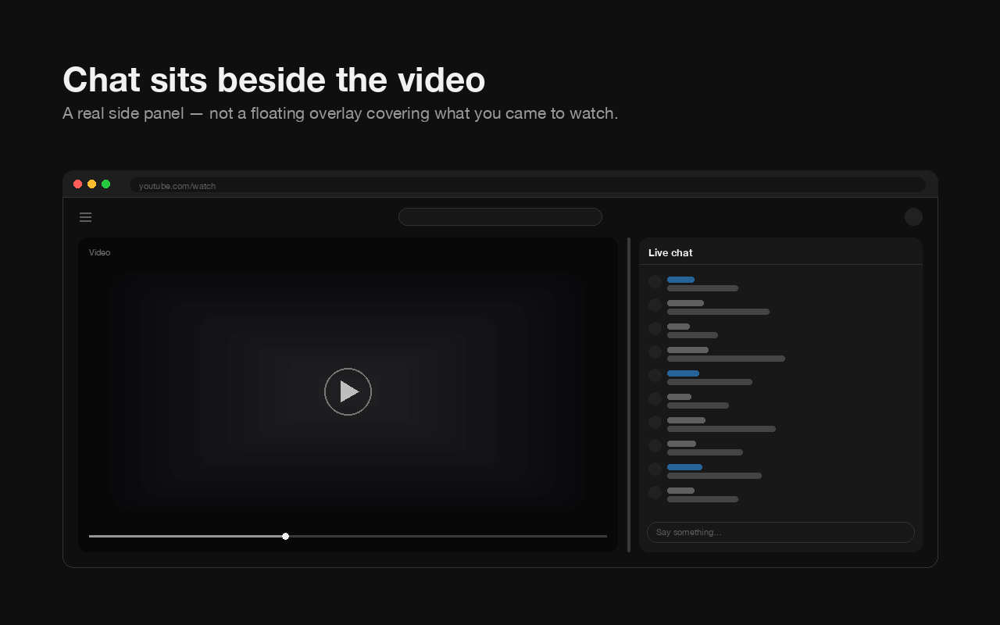
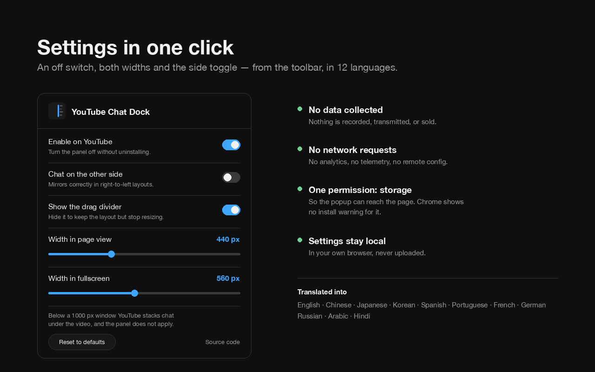
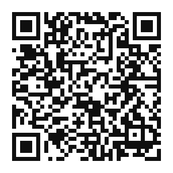

<div align="center">


# YouTube Chat Dock

**Live chat beside the video. Not on top of it.**

Turns YouTube's live chat and chat replay into a resizable side panel —
in page view, theater mode, and true fullscreen.

[](https://chromewebstore.google.com/detail/youtube-chat-dock/bkmbhlkcjbkjapbamkidacajjfhoiiam)
[](https://cc100053.github.io/YouTube-Chat-Dock/)
[](LICENSE)


[](https://github.com/cc100053/YouTube-Chat-Dock/stargazers)



</div>

---

## ✨ What it does

- **📐 A real side panel, not an overlay.** The player is resized to fit beside
  the chat, so chat never covers the video — and the video is never cropped to
  make room for it.
- **↔️ Drag the divider to resize.** Page view, theater and fullscreen each
  remember their own width. Double-click the divider to snap back.
- **🎬 Works in theater mode.** YouTube narrows the player there to reserve a
  side slot, then leaves the slot empty and drops chat underneath. This fills it.
- **🖥️ Works in true fullscreen.** Chat stays docked, the video stays uncropped.
- **⇄ Chat on either side.** Hover the divider and click the toggle. The choice
  sticks.
- **▶️ Chat replay too.** Replay on VODs behaves exactly like live chat.
- **📏 Narrow to 120px** without messages getting clipped.
- **🌍 Right-to-left layouts** dock chat on the correct side, and the divider
  flips with them.

## 📥 Install

**[Get it from the Chrome Web Store](https://chromewebstore.google.com/detail/youtube-chat-dock/bkmbhlkcjbkjapbamkidacajjfhoiiam)**
— or read the [feature overview and FAQ](https://cc100053.github.io/YouTube-Chat-Dock/) first.

Or load it unpacked — about thirty seconds, and there is nothing to build or
install first:

1. [Download the repo as a ZIP](https://github.com/cc100053/YouTube-Chat-Dock/archive/refs/heads/main.zip) and unzip it, or `git clone` it
2. Open `chrome://extensions/`
3. Turn on **Developer mode** (top right)
4. Click **Load unpacked** and pick the folder
5. Reload any open YouTube tab

Chrome 88+ and any Chromium browser — Edge, Brave, Opera, Arc.

## ⚙️ Settings

Click the toolbar icon.

<div align="center">

</div>

| Setting | What it does |
|---|---|
| **Enable on YouTube** | Turn the panel off without uninstalling |
| **Language** | Any of the 12, independently of your browser's language |
| **Chat on the other side** | Same as the divider's ⇄ toggle |
| **Three width sliders** | Page view, theater, fullscreen. They preview live as you drag, exactly like the divider does |
| **Reset to defaults** | Puts everything back |

You never have to open it, though — drag the divider, double-click to reset,
hover it and click ⇄ to switch sides.

## 🔒 Permissions and privacy

One permission, `storage`, and Chrome shows **no permission prompt** on install.
It exists for exactly one reason: the settings popup is a separate page and
cannot otherwise reach the tab it is configuring.

- ❌ No data collected, transmitted, or sold
- ❌ No network requests — no analytics, no telemetry, no remote config
- ❌ No background service worker; nothing runs when you are not on YouTube
- ❌ No account, no sign-in, no cloud sync
- ❌ No host permissions — it acts on `youtube.com` and nowhere else
- ✅ Your settings live in your own browser and never leave the device

Full policy: [store/PRIVACY.md](store/PRIVACY.md)

## 🌍 Languages

🇺🇸 English · 🇹🇼 繁體中文 · 🇨🇳 简体中文 · 🇯🇵 日本語 · 🇰🇷 한국어 ·
🇪🇸 Español · 🇧🇷 Português · 🇫🇷 Français · 🇩🇪 Deutsch · 🇷🇺 Русский ·
🇸🇦 العربية · 🇮🇳 हिन्दी

The picker is independent of the browser's language, so Chrome can be in one
language and this in another. Missing yours? Add it to [`i18n.js`](i18n.js) —
one object, no build step.

## ❓ FAQ

<!--
  Each heading is a question people actually type, and each answer opens with a
  direct sentence rather than a preamble. That first sentence is what search
  engines and LLMs lift; burying it after two clauses of context wastes it.
  Keep these in sync with docs/index.html, which carries the same answers as
  FAQPage structured data.
-->

### How do I put YouTube live chat next to the video?

Install an extension that docks it — YouTube itself gives you no control over
this. Chat is a fixed-width sidebar in page view and an overlay on top of the
video in fullscreen; neither can be resized, and neither puts chat beside the
video. This extension re-lays out the chat already on the page, so it stays
YouTube's own chat, with Super Chat, emotes, badges and moderation tools intact.

### Can I resize YouTube's live chat?

Yes — drag the divider between the video and the chat. Page view, theater and
fullscreen each remember their own width, so going fullscreen doesn't undo your
layout. Double-click the divider to snap back to the default.

### Why does YouTube put chat below the video in theater mode?

Because YouTube narrows the player in theater mode to reserve a side slot, then
leaves that slot empty and renders chat underneath instead. That's YouTube's own
behaviour — measured identical with this extension on and off. This fills the
slot with the chat it was reserved for, and resizes the reservation with it.

### Does live chat work in fullscreen on YouTube?

Yes, but only as an overlay. YouTube's fullscreen chat sits on top of the video
at a width you cannot change. With this extension it is docked beside the video
instead, at its own remembered width, covering nothing and cropping nothing.

### Does this work with chat replay on old streams?

Yes. Chat replay on a VOD is docked and resized exactly like live chat on an
active stream, with no separate setting.

### Can I move YouTube chat to the left side?

Yes — hover the divider and click the ⇄ toggle, or flip the switch in the popup.
The choice persists. In right-to-left languages it mirrors with the layout
rather than inverting, so "the other side" always means what it looks like.

### Does it collect any data?

No. It collects nothing, transmits nothing, and makes no network requests of any
kind. See [Permissions and privacy](#-permissions-and-privacy) above.

### Does it work in Edge, Brave, Opera or Arc?

Yes — Chrome 88+ and any Chromium browser. Install it from the Chrome Web Store,
which those browsers can all install from. It is not a Firefox add-on.

## ⚠️ Known limitations

- **Below a 1000px window**, YouTube switches to a single-column layout with
  chat under the video. The extension deliberately does not apply there, rather
  than fight YouTube's own responsive layout.
- **Clearing site data for youtube.com resets your widths.** They are kept in
  `localStorage` so they can be applied *before* the page paints, which is what
  stops the layout flickering on every load.
- **The side flip is unverified in true fullscreen and under RTL.** Its failure
  mode is benign: chat simply stays put.

## 🛠️ Under the hood

No build step, no dependencies, no framework.

| File | What it does |
|---|---|
| `dock.css` | All the layout — page, theater, fullscreen, the video fix, chat-iframe fixes, divider |
| `dock.js` | Drag logic and the storage mirror. Top frame only |
| `settings.js` · `i18n.js` | Keys and defaults; UI strings. Shared by the page and the popup |
| `popup.html/.css/.js` | The settings UI |

Almost every non-obvious line exists because a plausible assumption was measured
against YouTube's live DOM and turned out false. Three of them:

- **Theater mode was never broken by this extension.** Measured with it on and
  off, the two were identical: YouTube reserves a 450px slot beside the player,
  leaves it empty, and renders chat below. It also reparents the chat container
  between modes, so no single selector finds it in all three.
- **The `<video>` does not reflow.** YouTube writes its size as inline
  attributes from JS and never recomputes them when CSS resizes the player —
  measured: player `1157×651`, video still `1346×757`, visibly cropped.
- **RTL is not detectable from `<html dir>`.** With `hl=ar` YouTube leaves
  `documentElement` at `ltr` and puts `rtl` on `<body>` instead. The side is
  decided geometrically.

The comments in the source carry the measurements. They are the real
documentation.

<a id="support"></a>

## ❤️ Support

If this saved you some squinting:

<div align="center">

[](https://ko-fi.com/hangyodev)
[](https://github.com/cc100053/YouTube-Chat-Dock)

</div>

A star costs nothing and helps people find it.

<a id="crypto"></a>

### Crypto

<div align="center">

|  |  |
|:---:|:---:|
| **EVM** | **Solana** |
|     |  |

</div>

**EVM** — same address on Ethereum, Base, BNB Smart Chain and Arbitrum:

```
0x69c04f5Ec02fADBd71d09A7a5C494481C12c95aE
```

**Solana:**

```
EmgfSiuaZ7tvXd1bmV4nps53ydsXjfmNsL7kGxMf9JbQ
```

> [!IMPORTANT]
> Send only on the networks listed above. Anything sent on another chain, or
> as an unsupported token, is unrecoverable. Always check the first and last
> few characters after pasting.

## 📄 License

[MIT](LICENSE). Not affiliated with, endorsed by, or sponsored by YouTube or
Google.
